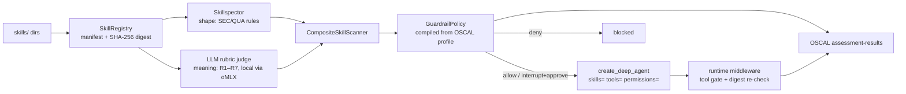

# oscal-skills-guardrails


-2ce6c8?style=flat-square)


**OSCAL as the policy brain for Agent Skills.** Every skill is scanned by two
independent evidence streams — a static scanner ([Skillspector](https://github.com/sw30labs/skillspector-trial))
and a local LLM rubric judge — then admitted, interrupted, or blocked against a
risk appetite you declare once, as a NIST OSCAL profile. Every decision comes back
out as OSCAL `assessment-results`. Policy in, evidence out, nothing un-vetted in
between.

The static scan catches the **shape** of an attack. The judge catches its
**meaning**. A skill that politely emails your contacts file "for backup" and asks
the agent not to mention it contains zero regex-shaped exfil — Skillspector grades
it **100/A**. The judge reads it and fails it at **critical**:

```text
AGENT     SKILL           SEV       SCORE  GRD  EFFECT   REASON
----------------------------------------------------------------------------------
default   meeting-notes   critical  100    A    deny     scan severity critical exceeds medium
default   tidy-notes      none      100    A    allow    skill allowed
```

That contradiction — `osg:scan-score: 100`, `osg:scan-severity: critical`, effect
`deny` — lands verbatim in the audit trail. It is the whole argument for two streams.

## How it works



One OSCAL profile drives all of it — admission thresholds, per-agent skill
visibility, tool allow/deny, filesystem rules, human-approval gates — and doubles
as the compliance artifact, with every control mapped to NIST SP 800-53.

| Control | Gate | 800-53 |
|---|---|---|
| SG-1 | Admission scanning — `max_scan_severity`, `min_score`, `min_grade` | RA-5, SI-3 |
| SG-2 | Integrity — digest re-verified at load and every run (TOCTOU closed) | SI-7, SR-4 |
| SG-3 | Visibility — per-agent/subagent skill allowlists, least exposure | AC-3, CM-7 |
| SG-4 | Tool least functionality — pre-filter + runtime middleware | CM-7(5), AC-6 |
| SG-5 | Skill filesystem protection | AC-6(1), CM-5 |
| SG-6 | Human approval — interrupt effects, recorded approvals | AC-3, CM-3 |
| SG-7 | Provenance — required metadata (owner, version) | SR-3, CM-8 |
| SG-8 | Audit — every decision as assessment-results observations/findings | AU-2, AU-12 |
| SG-9 | Semantic rubric review — `require_rubric` fails closed | SA-11, CA-2 |

## Quick start

```bash
git clone https://github.com/sw30labs/oscal-skills-guardrails.git
cd oscal-skills-guardrails
pip install -e '.[dev]' && pytest        # 36 passing

# point the judge at your local oMLX server (or any OpenAI-compatible endpoint)
export SKILL_JUDGE_MODEL='Qwen3.6-27B-bf16'
export SKILL_JUDGE_API_KEY=test

# gate everything under examples/skills against the OSCAL profile
PYTHONPATH=src python3 -m deepagent_skill_guardrails.cli admit \
  --skills examples/skills \
  --oscal-profile data/oscal-policies/skills-policy-profile.json \
  --scanner-cmd 'node scripts/scan_skill.mjs' \
  --lock-out out/skills.lock.json \
  --results out/assessment-results.json
```

Exit codes gate CI: `0` passed, `1` denials (or unapproved interrupts with
`--fail-on interrupt`), `2` error. Later, catch tampering across processes:

```bash
PYTHONPATH=src python3 -m deepagent_skill_guardrails.cli verify \
  --lock out/skills.lock.json --skills-root examples/skills
# changed / missing / new -> exit 1
```

Approve an interrupt-effect skill after human review — the approval is recorded in
the audit trail: `admit ... --approve reviewed-skill`.

## The gate as a CI status check

[`.github/workflows/skill-gate.yml`](.github/workflows/skill-gate.yml) runs on every
PR touching the skill catalog, the policy, or the gate itself — two required checks:

**admit** adjudicates the catalog against the OSCAL profile (Skillspector engine
checked out from its repo; the LLM judge joins when repo vars `SKILL_JUDGE_URL` +
`SKILL_JUDGE_MODEL` and secret `SKILL_JUDGE_API_KEY` point at an OpenAI-compatible
endpoint). Denials and unapproved interrupts fail the build; the decision table
lands in the job summary and the full OSCAL `assessment-results.json` is uploaded
as the build artifact — every merged PR carries its compliance evidence.

**verify** recomputes every skill digest against the committed
[`skills.lock.json`](skills.lock.json). Touching a skill without regenerating the
lock in the same PR fails the build — the lockfile diff is the review signal,
exactly like a dependency lockfile, but for agent capabilities.

## The two evidence streams

**Skillspector** (`scripts/scan_skill.mjs` wraps the offline engine for CI):
prompt-injection phrasing, invisible unicode, exfil shapes, dangerous shell,
obfuscated exec, hardcoded secrets, sensitive paths, persistence, safety-bypass
text — SEC-001…010, QUA-001…011, score 0–100, grade A–F.

**Rubric judge** (`RubricJudgeScanner`): an LLM grades the skill against a fixed
rubric — R1 intent alignment, R2 scope minimality, R3 tool justification, R4 data
boundary, R5 influence boundary, R6 provenance, R7 human oversight. Failed criteria
become ordinary findings at rubric-defined severities (the judge can confirm a
failure, never soften one), so the same OSCAL thresholds gate both streams. Skill
content is sentinel-wrapped as untrusted data; an injection attempt against the
judge is itself an R5 failure. A judge that errors or returns non-JSON is a
critical `RUB-JUDGE-ERROR` — fail closed.

Judges are pluggable one-liners: `omlx_judge("Qwen3.6-27B-bf16")` (local Apple
Silicon via [oMLX](https://github.com/jundot/omlx), skills never leave the machine),
`openai_chat_judge(url, model)` (LM Studio, Ollama, vLLM, OpenAI),
`command_judge(("claude", "-p"))`, or `langchain_judge("provider:model")`.

## Policy as an OSCAL profile

Author policy once, in OSCAL; the loader compiles it into the runtime engine.
YAML (`examples/policy.yaml`) and OSCAL are interchangeable:

```json
{
  "control-id": "sg-agt-coding-agent",
  "props": [
    { "name": "osg:target-type", "value": "agent" },
    { "name": "osg:target-id", "value": "coding-agent" },
    { "name": "osg:allow-skill", "value": "langgraph-*" },
    { "name": "osg:deny-tool", "value": "execute" },
    { "name": "osg:max-scan-severity", "value": "medium" },
    { "name": "osg:min-grade", "value": "B" },
    { "name": "osg:require-rubric", "value": "true" }
  ]
}
```

Full prop vocabulary, precedence rules, and the SG catalog:
[`docs/oscal-skills-profile-schema.md`](docs/oscal-skills-profile-schema.md).

## Guarding a Deep Agent

```python
from deepagent_skill_guardrails import (
    AgentContext, CompositeSkillScanner, OscalAssessmentSink, RubricJudgeScanner,
    SkillRegistry, SubprocessSkillScanner, load_skills_policy_profile, omlx_judge,
)
from deepagent_skill_guardrails.deepagents_factory import create_guarded_deep_agent

policy = load_skills_policy_profile("data/oscal-policies/skills-policy-profile.json")
scanner = CompositeSkillScanner(scanners=(
    SubprocessSkillScanner(command=("node", "scripts/scan_skill.mjs")),
    RubricJudgeScanner(judge=omlx_judge("Qwen3.6-27B-bf16"), judge_name="Qwen3.6-27B-bf16@omlx"),
))
registry = SkillRegistry(scanner=scanner)
registry.ingest_many(registry.discover("skills/"))

sink = OscalAssessmentSink(profile_href="data/oscal-policies/skills-policy-profile.json")
agent = create_guarded_deep_agent(
    model="openai:gpt-5.5",
    tools=[...],
    system_prompt="You are a guarded coding agent.",
    agent_context=AgentContext(agent_id="coding-agent"),
    policy=policy,
    registry=registry,
    audit_sink=sink,
    approved_skill_ids={"reviewed-skill"},   # SG-6 approval loop
)
# ... run the agent ...
sink.write("out/assessment-results.json")    # SG-8 closed loop
```

The factory filters skills and tools per policy before DeepAgents ever sees them,
re-verifies digests (`on_digest_mismatch="deny"` or `"rescan"`), installs runtime
middleware that gates every tool call and raises `SkillIntegrityError` if an
admitted skill mutates mid-session, and materializes filesystem permissions.

## Fail-closed invariants

Unknown skill → not loaded. Scanner crash, timeout, or bad JSON → critical finding.
Score/grade threshold set but scanner reported none → deny. `require_rubric` set
but no judge evidence → deny. Judge endpoint down → critical. Digest drift →
`SkillIntegrityError`. The gate never fails open.

## Project layout

```
data/oscal-policies/
  skill-guardrails-catalog.json    # SG control family (SG-1…SG-9, 800-53 links)
  skills-policy-profile.json       # example policy profile (osg: props)
docs/oscal-skills-profile-schema.md  # prop vocabulary, precedence, loader contract
scripts/scan_skill.mjs             # Skillspector engine -> JSON-on-stdout CLI
src/deepagent_skill_guardrails/
  models.py policy.py registry.py scanner.py    # core: records, gates, digests
  rubric_judge.py                  # rubric R1–R7, judge adapters, prompt hardening
  oscal_loader.py oscal_results.py # OSCAL in (profile), OSCAL out (assessment-results)
  middleware.py deepagents_factory.py           # runtime enforcement
  cli.py mcp_server.py             # admission CLI, scanner-as-MCP
examples/                          # policy.yaml + demo skills
skills.lock.json                   # committed digest baseline (SG-2, verified in CI)
.github/workflows/skill-gate.yml   # the CI gate: admit + verify on every skill PR
tests/                             # 36 tests, no network, stub judges
```

## Develop

```bash
pip install -e '.[dev]'
pytest                              # 36 passing, offline
node scripts/scan_skill.mjs --pretty examples/skills/langgraph-docs
```

Optional extras: `.[deepagents]` (runtime factory), `.[mcp]` (scanner as MCP
server), `.[judge]` (LangChain judge adapter). Rule ids (`SEC-*`, `QUA-*`, `RUB-*`),
`osg:` props, and SG control ids are stable contracts once tagged 1.0.

## Related

[skillspector-trial](https://github.com/sw30labs/skillspector-trial) — the offline
static scanner this wraps · [oscal-agent-guardrails](https://github.com/ai-agents-cybersecurity/oscal-agent-guardrails)
— the tool-level ancestor of this pattern · [NIST OSCAL](https://pages.nist.gov/OSCAL/) ·
[Agent Skills spec](https://agentskills.io/specification) ·
[oMLX](https://github.com/jundot/omlx)

## License

Apache-2.0
